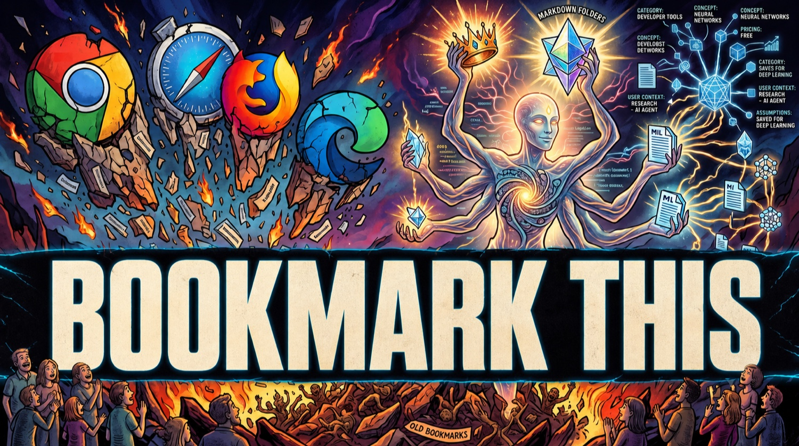
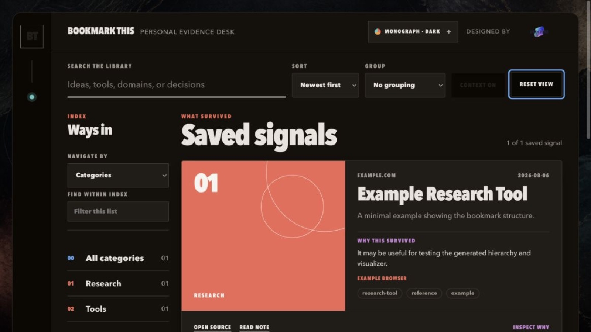

# Bookmark This

<p align="center">
  
</p>

Your bookmarks should not disappear into browser folders you never open again.

Bookmark This is a portable agent skill that turns saved links into a structured, user-owned Markdown library. It verifies pages, catches duplicates, records useful context, separates facts from inference, and generates navigation that stays useful as the collection grows.

It works with Codex, Claude, Hermes, OpenClaw, and other agents that can follow a `SKILL.md` workflow.

## Setup Starts With Three Questions

When you ask the skill to set up your bookmark system, it starts with:

1. Which agentic platform do you use?
2. Should I round up bookmarks from Chrome, Safari, Firefox, Edge, Brave, exported HTML, or folders you name?
3. Do you want the local bookmark visualizer now, later, or disabled—and should it be browse-only or editable?

You can answer `all available sources`, name specific browsers or profiles, say `not now`, or say `I don't know`. The agent will locate standard bookmark stores with read-only checks, show an inventory, and ask which sources are in scope before importing anything. If an operating system blocks access, it will offer the browser's native bookmark export instead of reaching into unrelated browser data.

Immediately afterward, the skill asks whether it may use any context you approve—such as the current session, project instructions, selected notes, or a `MEMORY.md` file—to improve its `Why I may have saved it` inference. You can decline and keep the system fully generic.

This optional context is where Bookmark This becomes markedly more useful: it can connect a page to recurring projects, preferences, and decisions instead of guessing at a generic reason to revisit it. Access remains opt-in, source labels stay visible, and copied memories or conversation transcripts are never stored in the configuration.

From there, the skill proposes a small category system based on what you actually save. You approve it, rename it, or delegate the choice. You do not have to design a taxonomy from scratch.

For a large browser library, Bookmark This first imports everything into a deduplicated, searchable structure while preserving browser, profile, and old-folder provenance. It labels links it has not opened as imported but unverified, then enriches them progressively or in batches. It never claims hundreds of pages were individually checked when only browser metadata was available.

## What It Creates

```text
your-bookmark-library/
├── .bookmark-system/
│   └── config.json
├── index.md
├── bookmarks/
├── collections/
├── visualizer/              # optional
│   └── index.html
└── views/
    ├── categories/
    └── tags/
```

Bookmark files stay in a stable location. Categories, tags, collections, and generated views provide the hierarchy without forcing file moves whenever your interests change.

## Optional Visualizer

<p align="center">
  
</p>

The visualizer is a single local HTML file. It provides:

- full-text search across titles, summaries, domains, categories, and tags
- faceted filtering by category, year, month, tag, source browser, keyword, domain, media type, enrichment status, original folder, and approved context source
- sorting by date, title, domain, or source browser
- collapsed-by-default drawer grouping by date, category, primary tag, browser, keyword, domain, media type, enrichment status, original folder, or approved context source
- localhost-only tag editing, persistent `Filter out` controls, restoration, and recoverable removal when editable mode is enabled
- readable bookmark cards
- links to the original source and the local Markdown note
- an optional `Why this survived` view grounded in user-approved context
- visible context-source labels and a control to hide personal inference
- four visual themes—Archive, Grove, Signal, and Monograph—each with Auto, Light, and Dark modes; new visualizers open in Monograph Dark
- locally remembered appearance preferences with no account or tracking
- locally cached Open Graph artwork for visual bookmark cards
- playable YouTube, Vimeo, supported Instagram, and direct-video previews when the provider permits embedding
- opt-in TradingView charts for explicit ticker symbols; market data may be live or provider-delayed
- a continuous editorial background across the navigation, controls, and library workspace
- no account, analytics, or database; the optional editing workspace uses Python's localhost-only server and Markdown remains canonical

The Markdown library remains the source of truth. Opening `visualizer/index.html` directly is private and read-only. Run `python3 skills/bookmark-this/scripts/bookmark_system.py serve <your-library>` for the editable workspace; tag changes write to frontmatter, filtered bookmarks remain recoverable, and removals move to `.bookmark-system/trash/` rather than being permanently erased.

Remote video players and market charts contact third-party providers and require internet access. Setup asks whether to load them automatically, ask before each load, or disable them. Publisher restrictions can prevent playback, especially on news and social platforms; the cached preview image and original link remain available as the fallback.

## Install

Download `bookmark-this-v0.1.0.zip` from the [latest release](https://github.com/nikkogibler/bookmark-this/releases/latest), unzip it, and place the `bookmark-this` folder in your platform's skills directory.

Or clone the repository:

```bash
git clone https://github.com/nikkogibler/bookmark-this.git
```

### Codex

```bash
cp -R bookmark-this/skills/bookmark-this ~/.codex/skills/
```

Then start a new Codex task and say:

```text
Use $bookmark-this to set up my bookmark system.
```

### Claude Code

```bash
cp -R bookmark-this/skills/bookmark-this ~/.claude/skills/
```

Then invoke `/bookmark-this` or say:

```text
Set up my bookmark system.
```

### Hermes

Install directly from GitHub:

```bash
hermes skills install nikkogibler/bookmark-this/skills/bookmark-this
```

Then say:

```text
Set up my bookmark system.
```

### OpenClaw

After cloning the repository, install the skill globally:

```bash
openclaw skills install ./bookmark-this/skills/bookmark-this --global
```

Then reference `$bookmark-this` or say:

```text
Set up my bookmark system.
```

See [docs/platforms.md](docs/platforms.md) for project-local installation and links to each platform's current skill documentation.

## Use It

Setup:

```text
Set up my bookmark system.
```

Capture a link:

```text
Bookmark this: https://example.com/useful-page
```

Query the library naturally:

```text
Show me the tools I saved for customer research.
```

Refresh the generated navigation and optional visualizer:

```text
Rebuild my bookmark library.
```

Check its health:

```text
Validate my bookmark system and fix anything incomplete.
```

Backfill preview media for an existing library:

```text
Add Open Graph artwork and supported rich-media previews to my existing bookmarks. Test a small batch first and report failures before continuing.
```

## What Each Bookmark Contains

Every bookmark records:

- a safe saved URL and canonical URL when available
- title, domain, capture date, tags, categories, and status
- a concise description and important details
- practical reasons to revisit the page
- caveats, verification gaps, or marketing claims worth remembering
- an optional personal-relevance assessment labelled `Inference, not confirmed`
- source links

The skill strips sensitive tokens and common tracking parameters rather than preserving dangerous URLs.

## Safety And Privacy

- Your bookmark library stays in folders you choose.
- Existing bookmark folders are inventoried before any proposed migration.
- Browser roundup is opt-in, read-only, and supports Chromium browsers, Safari, Firefox exports, bookmark HTML, and approved Markdown folders.
- Source files are not deleted automatically.
- Open Graph preview images are cached locally when possible; unsafe or credential-bearing media URLs are rejected.
- Remote video and stock widgets are permissioned separately because they can share network and browser information with their providers.
- Personal-relevance reasoning is optional and always labelled as inference.
- Secrets, cookies, credentials, and sensitive URL parameters must not be stored.
- The visualizer is local and dependency-free.
- Editable mode binds only to localhost and uses an in-memory request token; direct HTML viewing remains read-only.
- Bookmarking does not mutate task managers, CRMs, or other external systems.

## Repository Layout

```text
bookmark-this/
├── README.md
├── LICENSE
├── CONTRIBUTING.md
├── CODE_OF_CONDUCT.md
├── docs/
│   └── platforms.md
├── examples/
│   ├── config.json
│   └── example-bookmark.md
├── images/
│   ├── bookmark-this-hero.jpg
│   └── visualizer-preview.jpg
├── tests/
│   └── test_bookmark_system.py
└── skills/
    └── bookmark-this/
        ├── SKILL.md
        ├── agents/
        │   └── openai.yaml
        ├── assets/
        │   ├── interzekt-logo.png
        │   ├── visualizer-background.jpg
        │   └── visualizer-template.html
        ├── references/
        └── scripts/
            ├── backfill_media.py
            ├── bookmark_system.py
            └── extract_page_metadata.py
```

## Requirements

- An agent capable of reading `SKILL.md` instructions and local files
- Python 3 for deterministic index generation, validation, and visualization
- Web access when you want the agent to verify a page before saving it

The maintenance and media-extraction scripts use Python's standard library only.

## Contributing

Bug reports, installation notes, and narrowly scoped improvements are welcome. Read [CONTRIBUTING.md](CONTRIBUTING.md) before opening a pull request.

## License

Bookmark This is released under the [MIT License](LICENSE).
