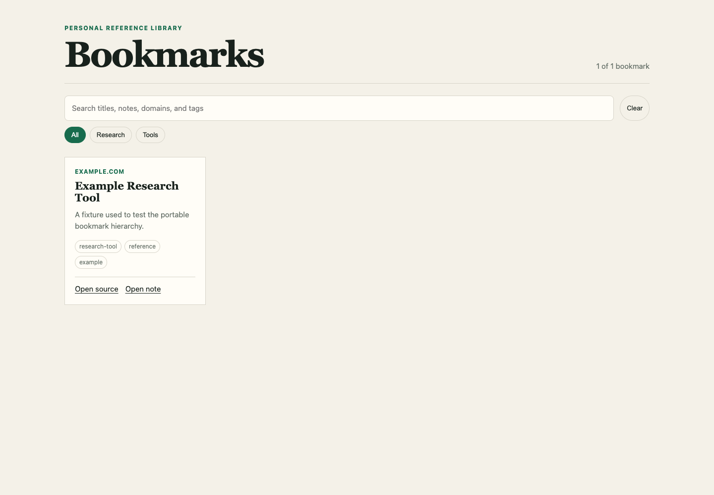

# Bookmark This

<p align="center">
  
</p>

Your bookmarks should not disappear into browser folders you never open again.

Bookmark This is a portable agent skill that turns saved links into a structured, user-owned Markdown library. It verifies pages, catches duplicates, records useful context, separates facts from inference, and generates navigation that stays useful as the collection grows.

It works with Codex, Claude, Hermes, OpenClaw, and other agents that can follow a `SKILL.md` workflow.

## The Setup Takes Three Questions

When you ask the skill to set up your bookmark system, it starts with:

1. Which agentic platform do you use?
2. Do you know where your bookmarks live now?
3. Do you want the local bookmark visualizer now, later, or disabled?

You can answer `I don't know` to the folder question. The agent will help locate likely folders using read-only checks, show you the candidates, and ask which ones are in scope before migrating anything.

From there, the skill proposes a small category system based on what you actually save. You approve it, rename it, or delegate the choice. You do not have to design a taxonomy from scratch.

## What It Creates

```text
your-bookmark-library/
├── .bookmark-system/
│   └── config.json
├── index.md
├── bookmarks/
├── collections/
├── visualizer/              # optional
│   └── index.html
└── views/
    ├── categories/
    └── tags/
```

Bookmark files stay in a stable location. Categories, tags, collections, and generated views provide the hierarchy without forcing file moves whenever your interests change.

## Optional Visualizer

<p align="center">
  
</p>

The visualizer is a single local HTML file. It provides:

- full-text search across titles, summaries, domains, categories, and tags
- category filtering
- readable bookmark cards
- links to the original source and the local Markdown note
- no server, account, analytics, database, or external JavaScript

The Markdown library remains the source of truth. The visualizer can be regenerated at any time.

## Install

Download `bookmark-this-v0.1.0.zip` from the [latest release](https://github.com/nikkogibler/bookmark-this/releases/latest), unzip it, and place the `bookmark-this` folder in your platform's skills directory.

Or clone the repository:

```bash
git clone https://github.com/nikkogibler/bookmark-this.git
```

### Codex

```bash
cp -R bookmark-this/skills/bookmark-this ~/.codex/skills/
```

Then start a new Codex task and say:

```text
Use $bookmark-this to set up my bookmark system.
```

### Claude Code

```bash
cp -R bookmark-this/skills/bookmark-this ~/.claude/skills/
```

Then invoke `/bookmark-this` or say:

```text
Set up my bookmark system.
```

### Hermes

Install directly from GitHub:

```bash
hermes skills install nikkogibler/bookmark-this/skills/bookmark-this
```

Then say:

```text
Set up my bookmark system.
```

### OpenClaw

After cloning the repository, install the skill globally:

```bash
openclaw skills install ./bookmark-this/skills/bookmark-this --global
```

Then reference `$bookmark-this` or say:

```text
Set up my bookmark system.
```

See [docs/platforms.md](docs/platforms.md) for project-local installation and links to each platform's current skill documentation.

## Use It

Setup:

```text
Set up my bookmark system.
```

Capture a link:

```text
Bookmark this: https://example.com/useful-page
```

Query the library naturally:

```text
Show me the tools I saved for customer research.
```

Refresh the generated navigation and optional visualizer:

```text
Rebuild my bookmark library.
```

Check its health:

```text
Validate my bookmark system and fix anything incomplete.
```

## What Each Bookmark Contains

Every bookmark records:

- a safe saved URL and canonical URL when available
- title, domain, capture date, tags, categories, and status
- a concise description and important details
- practical reasons to revisit the page
- caveats, verification gaps, or marketing claims worth remembering
- an optional personal-relevance assessment labelled `Inference, not confirmed`
- source links

The skill strips sensitive tokens and common tracking parameters rather than preserving dangerous URLs.

## Safety And Privacy

- Your bookmark library stays in folders you choose.
- Existing bookmark folders are inventoried before any proposed migration.
- Source files are not deleted automatically.
- Personal-relevance reasoning is optional and always labelled as inference.
- Secrets, cookies, credentials, and sensitive URL parameters must not be stored.
- The visualizer is local and dependency-free.
- Bookmarking does not mutate task managers, CRMs, or other external systems.

## Repository Layout

```text
bookmark-this/
├── README.md
├── LICENSE
├── CONTRIBUTING.md
├── CODE_OF_CONDUCT.md
├── docs/
│   └── platforms.md
├── examples/
│   ├── config.json
│   └── example-bookmark.md
├── images/
│   ├── bookmark-this-hero.jpg
│   └── visualizer-preview.png
├── tests/
│   └── test_bookmark_system.py
└── skills/
    └── bookmark-this/
        ├── SKILL.md
        ├── agents/
        │   └── openai.yaml
        ├── references/
        └── scripts/
            └── bookmark_system.py
```

## Requirements

- An agent capable of reading `SKILL.md` instructions and local files
- Python 3 for deterministic index generation, validation, and visualization
- Web access when you want the agent to verify a page before saving it

The maintenance script uses Python's standard library only.

## Contributing

Bug reports, installation notes, and narrowly scoped improvements are welcome. Read [CONTRIBUTING.md](CONTRIBUTING.md) before opening a pull request.

## License

Bookmark This is released under the [MIT License](LICENSE).
